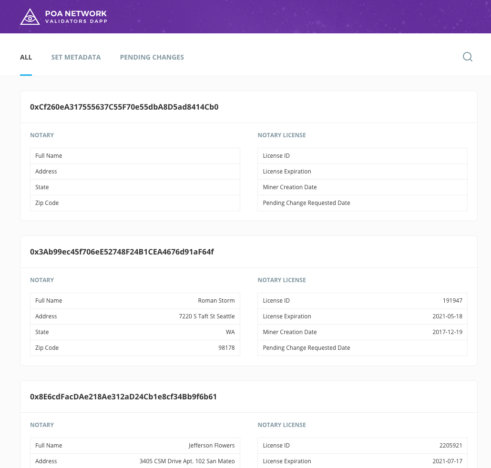
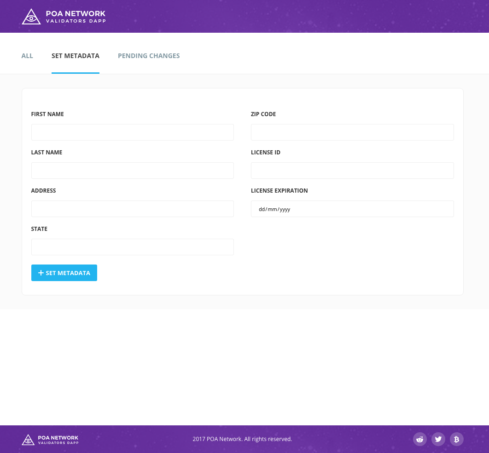

# POA Network Validators Dapp

## Supported browsers

* Google Chrome v 59.0.3071.115+

## MetaMask plugin setup

* Connect to POA Network in MetaMask plugin (See [Connect to POA Network via MetaMask](https://github.com/oraclesorg/oracles-wiki/blob/master/MetaMask-connect.md#connect-to-oracles-network-via-metamask))





## Configuration file
It is configured with [POA Network contract](https://github.com/oraclesorg/poa-network-consensus-contracts)

Path: [`./src/contracts/addresses.js`](./src/contracts/addresses.js)

```
module.exports = {
  METADATA_ADDRESS: '0xce9ff1123223d13672cce06dd073d3749764daa6',
  KEYS_MANAGER_ADDRESS: '0x88a34124bfffa27ef3e052c8dd2908e212643771',
  POA_ADDRESS: '0x8bf38d4764929064f2d4d3a56520a76ab3df415b'
}
```

## Building from source

1) `npm i`

2) `npm start`