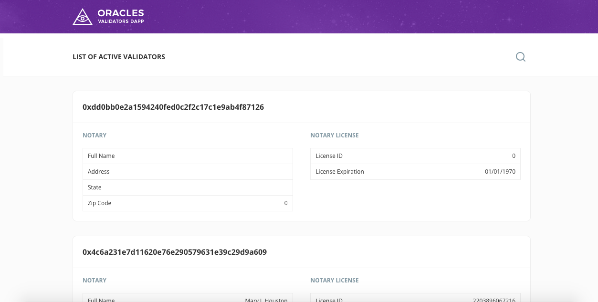

# Oracles network Validators List Dapp



## Configuration file
It is configured with [Oracles network contract](https://github.com/oraclesorg/oracles-contract)

Path: `./assets/javascripts/config.json`

```
{
  "environment": "live",
  "Ethereum": {
    "live": {
      "account": "Oracles_contract_owner_address",
      "contractAddress": "Oracles_contract_address"
    }
  }
}
```
