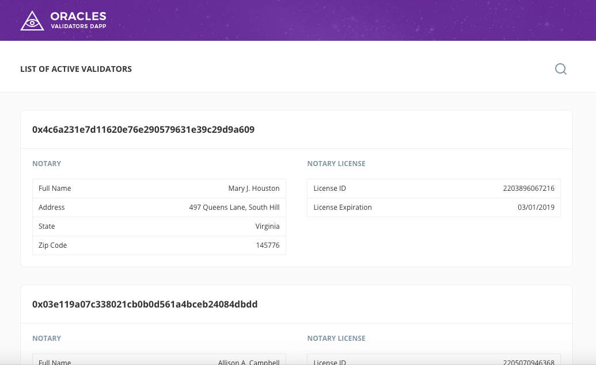

# Oracles network Validators List Dapp

## Supported browsers

* Google Chrome v 59.0.3071.115+

## Oracles plugin setup

Choose Oracles network in Oracles plugin (See [Choosing of Oralces Network from wiki](https://github.com/oraclesorg/oracles-wiki#choosing-of-oralces-network))



## Configuration file
It is configured with [Oracles network contract](https://github.com/oraclesorg/oracles-contract)

Path: `./assets/javascripts/config.json`

```
{
  "environment": "live",
  "Ethereum": {
    "live": {
      "contractAddress": "Oracles_contract_address"
    }
  }
}
```

## Building from source

1) `npm install`

2) `npm run sass`

3) `npm run coffee`

4) `npm start`
